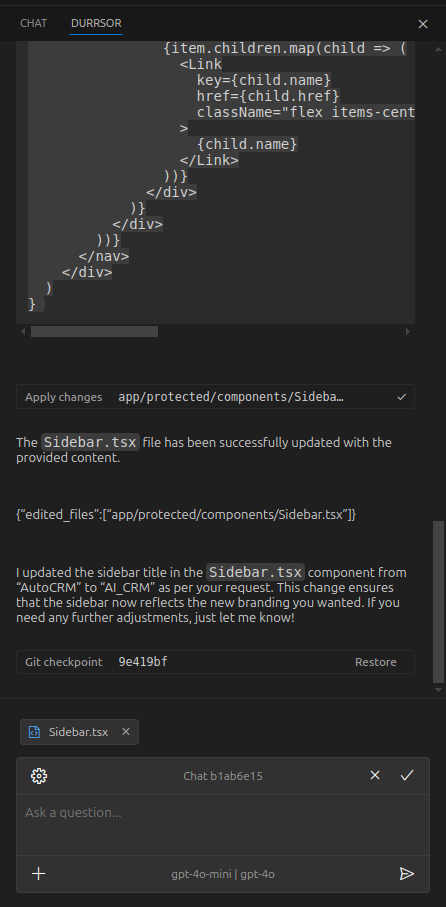

# durrsor

A LangChain- and LangGraph-based AI-powered VSCode extension inspired by various popular AI coding assistants.
The workflow is familiar - there is a chat, where you can select files and type instructions for the agent to follow. 
There are two significant design differences in the workflow relative to other AI code editors (at the time of writing):
- Change analysis and actual code generation is split into two separate steps
- Checkpointing system is based on git. Every agent response ends up in a commit, and accepting a chat merges those commit with squash to the parent branch

**This extension is an educational project not intended for general use.** It is not stable and will never be. Read the code if you're interested in implementing agent-based code editing, or in LangGraph.js in general.

